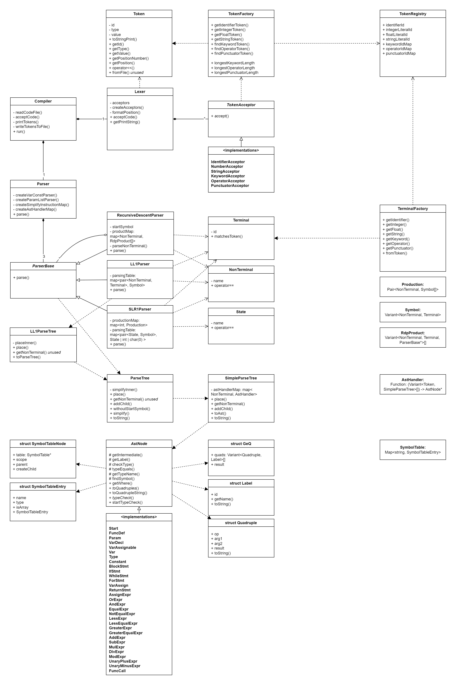

This is my attempt to write a simple compiler written using modern C++. It compiles with the most basic features using C as a reference (with some changes).

## Notes on Installation
This is a CMake project. C++20 modules are used, so it requires versions of tools as recent as 2023. There is a [blog post](https://www.kitware.com/import-cmake-the-experiment-is-over/) talking about it.
Reference of the required cmake, ninja, and clang versions for c++20 modules:
- CMake: CMake 3.28 or newer
- Ninja: Ninja 1.11.1 or newer
- Clang: Clang 16 or newer

This project uses the Catch2 test framework. I use VSCode's integration with C/C++ and CMake to build the project.

## Details
Details of the language and grammar can be viewed in [language-spec.md](./doc/language-spec.md).

Details about the AST can be viewed in [ast.md](./doc/ast.md).

The class diagram is shown below for reference.

