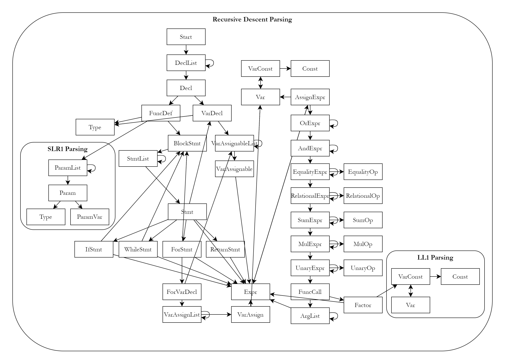

# Language Spec

## Grammar
The BNF grammar of the language is as follows.

Three types of parsing are used. By default, the parsing of the grammar is done with recursive descent parsing. Grammar labelled with SLR1 and LL1 are parsed with the corresponding methods instead.

```
Start ::= DeclList
DeclList ::= Decl DeclList | Decl
Decl ::= FuncDef | VarDecl

FuncDef ::= Type id ( ParamList ) BlockStmt

% SLR1 %
% Note 1 %
ParamList ::= Param , ParamList | Param | ε
Param ::= Type ParamVar
ParamVar ::= id [ ] | id
Type ::= int | float | str

VarDecl ::= Type VarAssignableList ;
VarAssignableList ::= VarAssignable , VarAssignableList | VarAssignable
VarAssignable ::= id = Expr | id [ intconst ] | id

VarConst ::= Var | Constant
Constant ::= intconst | floatconst | strconst
Var ::= id [ VarConst ] | id
Type ::= int | float | str

BlockStmt ::= { StmtList }
StmtList ::= Stmt StmtList | ε
Stmt ::= VarDecl | IfStmt | WhileStmt | ForStmt | ReturnStmt | Expr ; | ;

IfStmt ::= if ( Expr ) BlockStmt else BlockStmt | if ( Expr ) BlockStmt

WhileStmt ::= while ( Expr ) BlockStmt

ForStmt ::= for ( ForVarDecl ; Expr ; Expr ) BlockStmt
ForVarDecl ::= VarAssignList | ε
VarAssignList ::= VarAssign, VarAssignList | VarAssign
VarAssign ::= Var = Expr

ReturnStmt ::= return Expr ; | return ;

% Note 2 %
Expr ::= AssignExpr
AssignExpr ::= Var = Expr | OrExpr
OrExpr ::= OrExpr || AndExpr | AndExpr
AndExpr ::= AndExpr && EqualityExpr | EqualityExpr
EqualityExpr ::= EqualityExpr EqualityOp RelationalExpr | RelationalExpr
RelationalExpr ::= RelationalExpr RelationalOp SumExpr | SumExpr
SumExpr ::= SumExpr SumOp MulExpr | MulExpr
MulExpr ::= MulExpr MulOp UnaryExpr | UnaryExpr
UnaryExpr ::= UnaryOp UnaryExpr | FuncCall
FuncCall ::= id ( ArgList ) | Factor
ArgList ::= Expr , ArgList | Expr | ε
Factor ::= ( Expr ) | VarConst

EqualityOp ::= == | !=
RelationalOp ::= < | <= | > | >=
SumOp ::= + | -
MulOp ::= * | / | %
UnaryOp ::= + | - | !

% LL1 %
% Note 3 %
VarConst ::= Var | Constant
Constant ::= intconst | floatconst | strconst
Var ::= id [ VarConst ] | id
```

The following notes detail the rewritten grammar that can suit the particular parsing method.

Note 1: SLR1 grammar of the ParamList grammar
```
S ::= ParamList
ParamList ::= Param , ParamList | Param | ε
Param ::= Type ParamVar
ParamVar ::= id [ ] | id
Type ::= int | float | str
```

Note 2: Non left-recursive grammar for the Expr grammar
```
Expr ::= AssignExpr
AssignExpr ::= Var = Expr | OrExpr
OrExpr ::= AndExpr OrExpr'
OrExpr' ::= || AndExpr OrExpr' | ε
AndExpr ::= EqualityExpr AndExpr'
AndExpr' ::= && EqualityExpr AndExpr' | ε
EqualityExpr ::= RelationalExpr EqualityExpr'
EqualityExpr' ::= EqualityOp RelationalExpr EqualityExpr' | ε
RelationalExpr ::= SumExpr RelationalExpr'
RelationalExpr' ::= RelationalOp SumExpr RelationalExpr' | ε
SumExpr ::= MulExpr SumExpr'
SumExpr' ::= SumOp MulExpr SumExpr' | ε
MulExpr ::= UnaryExpr MulExpr'
MulExpr' ::= MulOp UnaryExpr MulExpr' | ε
UnaryExpr ::= UnaryOp UnaryExpr | FuncCall
FuncCall ::= id ( ArgList ) | Factor
ArgList ::= Expr , ArgList | Expr | ε
Factor ::= ( Expr ) | VarConst
```

Note 3: LL1 grammar for the VarConst grammar
```
S ::= VarConst
VarConst ::= Var | Constant
Constant ::= intconst | floatconst | strconst
Var ::= id Var'
Var' ::= [ Var ] | ε
```

## Diagram View

Productions are shown in the diagram below with arrows showing "uses" relationships, together with the parsing method used.



## Precedence, Associativity
Operators are listed top to bottom, in descending precedence.  
l: left-to-right associativity  
r: right-to-left associativity  
My reference: https://en.cppreference.com/w/c/language/operator_precedence  
```
l function call, array subscripting () []
r unary: unary plus/minus, logical NOT + - !
l multiplication, division, remainder * / %
l addition, subtraction + -
l relational operators <, <=, >, >=
l relational operators ==, !=
l Logical AND &&
l Logical OR ||
r assignment operators =
```

## Notes about the Language
Trailing commas are allowed in function parameter lists and function call argument lists.

Inner/nested blocks are not supported.

Single-subscripted array types are supported, but multiple-subscription is not supported. List instantiation is not supported. Declarations of an array must include an integer specifying its size (A[n]). A function parameter of an array type must be specified without its size (A[]). Integer variables or constants can be used for indexing an array, but expressions cannot.

Type checking is limited (see below).

## Types and Operations Allowed
Types recognized in the language are `int`, `float`, `str`, `bool`, `func`, `any`, and `none`.

Variables can be declared types `int`, `float`, and `str`. Assigned types must match the declared type (no casting). Redefinitions of types and functions are allowed (newer definitions will semantically replace older definitions).

Array indexing (A[i]) can be applied on single-subscripted array types declared as `int[n]`, `float[n]`, and `str[n]`.

Conditions in if, for, and while statements must have the `bool` or `int` type.

Function calls can be applied on identifiers of the `func` type.

No type checking is applied to (the number of and the types of) the actual arguments of a function call and its return type. A function call evaluate to the `any` type.

The `any` type voids type checking for an identifier, which means a value of the type can be viewed as any other type.

The `none` type is the type "returned" by statements or structures without a type.

The operand(s) of logical expressions `&&`, `||`, and `!` must have the `bool` or `int` type.

The equality expressions `==` and `!=` compare either numeric (`int`/`float`) values or `str` values.

The relational expressions `<`, `<=`, `>`, and `>=` compare either numeric (`int`/`float`) values or `str` values.

The add expression `+` adds two numeric (`int`/`float`) values or two `str` values. It returns a `float` if any operand is a float, and `int` or `str` otherwise.

The subtract expression `-`, multiply expression `*`, division expression `/`, and mod expression `%` operate on two numeric (`int`/`float`) values. (The mod expression in Python curiously operates properly on `float`s.) It returns a `float` if any operand is a float, and `int` otherwise.

The unary plus `+` and minus `-` expressions operates on a numeric (`int`/`float`) value.
